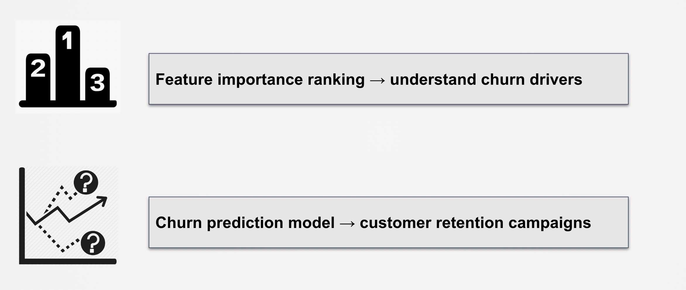
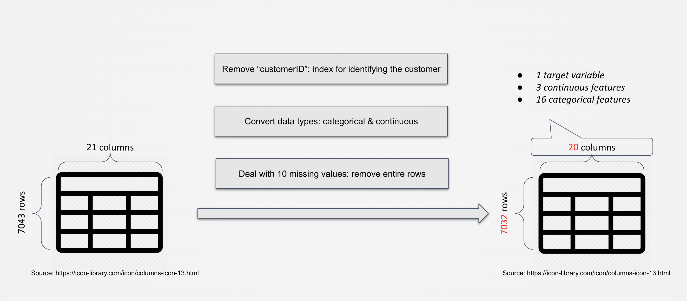
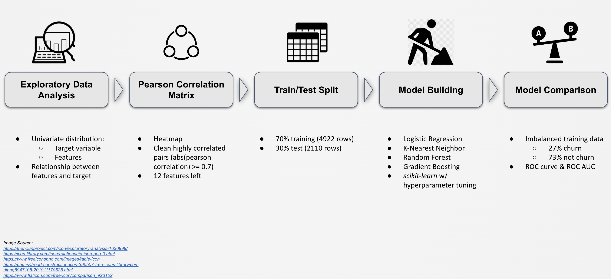
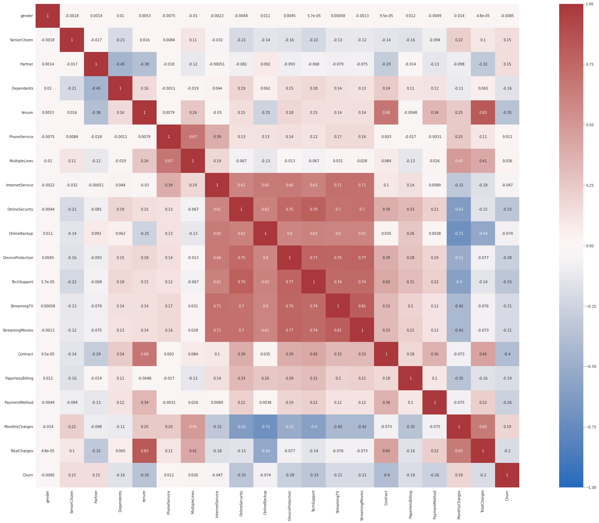
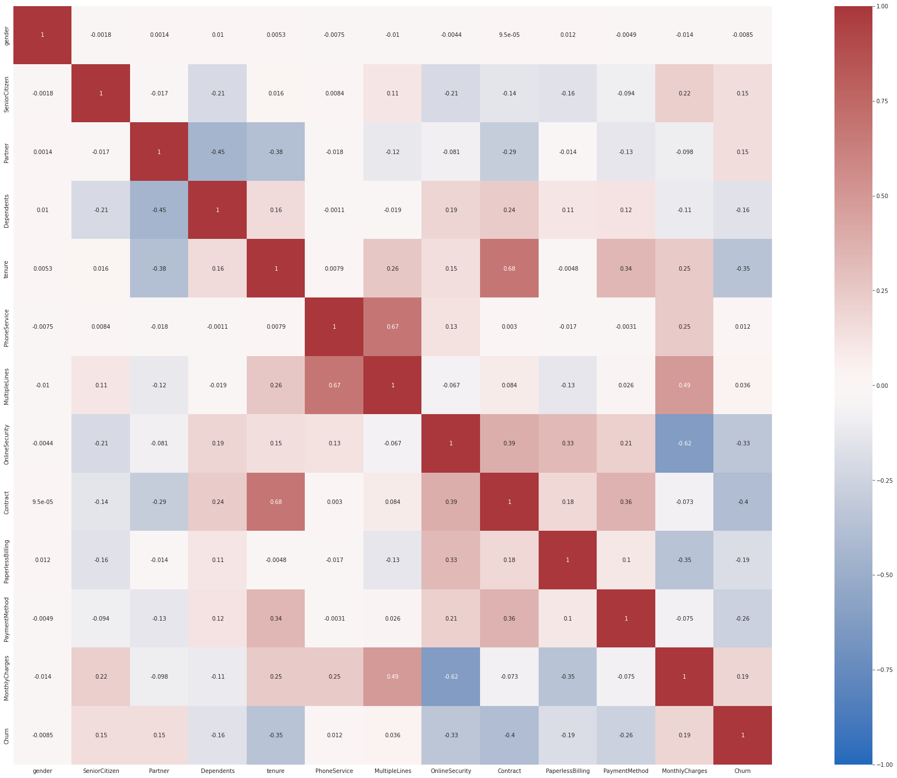
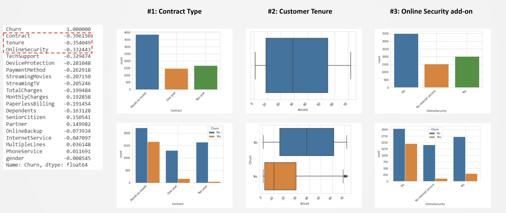
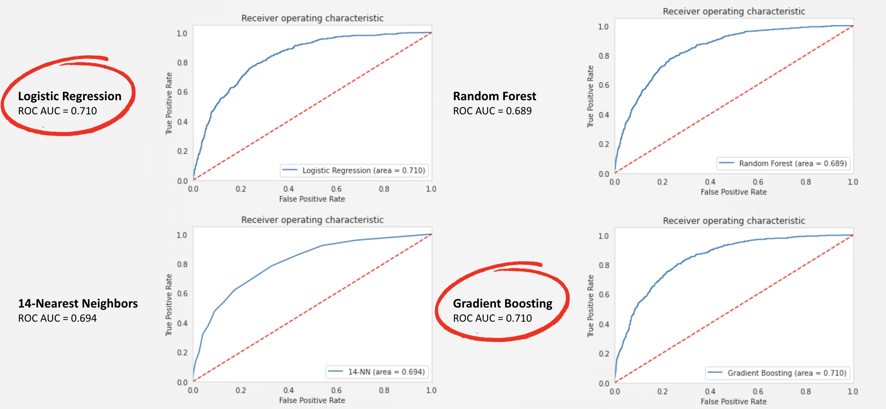

# Telecom Industry - _Customer Churn Analysis and Prediction_

## Objective

This project has two goals. The first is a ranking of feature importance, which can be used to identify key churn drivers. The second is a model to predict customer churns, which can be useful for customer retention campaigns.

## Data Cleaning

The dataset, sourced from Kaggle, comprises 7043 observations and 21 variables, each observation representing an individual customer. The initial step in the data preprocessing involved the removal of the 'customerID' column. This column served merely as an identifier and held no analytical value for the study's objectives.

A critical component of the dataset is the 'Churn' column, which acts as a binary indicator of whether a customer has churned. This variable is pivotal for the predictive modeling of customer churn.

Subsequent to the initial assessment, the variables were reclassified according to their intrinsic nature into two distinct categories: categorical and continuous. This reclassification was fundamental to align the data with the requirements of the predictive model.

During the data integrity check, it was identified that the 'TotalCharges' variable contained 10 missing entries. Given the negligible proportion of these missing values relative to the dataset's size, the decision was made to exclude these observations from further analysis.

The resulting cleaned dataset thus consists of 7032 observations and 20 variables. This includes one target variable (Churn), three continuous variables, and sixteen categorical variables, providing a comprehensive framework for the ensuing analysis.

## Methodology

The initial phase of the project involved a comprehensive exploratory analysis. This stage was crucial for gaining insights into the dataset's structure and underlying patterns. The analysis began with a univariate examination of both the target variable and the individual features, followed by an exploration of their interrelations.

A pivotal aspect of this phase was the assessment of pairwise correlations among the variables, utilizing Pearson's correlation coefficient as the primary metric. This was visualized through a correlation matrix heatmap, providing a clear representation of the inter-variable relationships. Variables exhibiting a Pearson correlation coefficient of 0.7 or higher were deemed highly correlated.

To mitigate multicollinearity issues, one variable from each highly correlated pair was excluded, resulting in a refined set of 12 features.

The dataset was then partitioned into training and testing subsets, with a 70:30 ratio. This split ensured robust model training and effective performance evaluation. Four predictive models were employed: Logistic Regression, K-Nearest Neighbors (KNN), Random Forest, and Gradient Boosting. These models were implemented using Python's scikit-learn library, with a focus on hyperparameter tuning to optimize performance.

The training dataset exhibited an imbalance, with 27% of the data flagged for churn and 73% not. To address this imbalance and accurately assess model performance, the Receiver Operating Characteristic (ROC) curve and the Area Under the ROC Curve (ROC AUC) were utilized as primary evaluation metrics. These tools are particularly effective in contexts of imbalanced datasets, allowing for a more nuanced comparison of model efficacy.

## Results: Top 3 Variables Related to Churn

In the exploratory analysis, three primary variables emerged as significantly correlated with customer churn: contract type, tenure, and online security.

1. Contract Type: This variable delineates the nature of the customer's agreement with the company. Analysis reveals a higher propensity for churn among customers with month-to-month contracts. Notably, a substantial portion of the customer base is on such short-term agreements. This finding suggests that encouraging customers to opt for longer-term contracts (1 or 2 years) may effectively reduce churn rates.

2. Tenure: Tenure refers to the duration for which a customer has been associated with the company. The data indicates a concentration of customer tenures between 9 and 55 months. A critical observation is that shorter tenures correlate with increased likelihood of churn. This insight points to the need for strategies aimed at fostering longer customer relationships.

3. Online Security: The variable 'Online Security' is categorized into three levels, dependent on whether the customer has internet service. The categories are 'No' (no online security), 'Yes' (online security present), and 'No Internet Service'. The majority of customers who have opted for internet services do not have online security. Interestingly, customers with online security are less prone to churn. This indicates that promoting online security services could potentially contribute to lower churn rates.

Each of these variables provides a unique lens through which to understand customer behavior and preferences, opening up strategic avenues for targeted interventions to reduce churn.

## Results: Model Performance Comparison

The predictive models were compared using the Receiver Operating Characteristic (ROC) curve and the corresponding Area Under the Curve (AUC) metric. The ROC AUC is a comprehensive measure of a model's ability to distinguish between binary classes, in this case, churn and no churn.

Notably, the ROC AUC for both the Gradient Boosting and Logistic Regression models was 0.710. This performance equivalence indicates that these two models are equally capable of accurately predicting customer churn in the given dataset. The ROC AUC value of 0.710 indicates a substantial level of predictive accuracy, highlighting the models' ability to distinguish between customers who are likely to churn and those who are not.

The results of this ROC AUC analysis are useful in guiding the selection of the best model for practical use in churn prediction. Given their comparable performance metrics, the decision between Gradient Boosting and Logistic Regression may be influenced further by factors such as model complexity, interpretability, and computational efficiency.

